

# 1.研究背景与意义


随着人工智能技术的快速发展，计算机视觉领域的研究也取得了巨大的进展。目标检测是计算机视觉中的一个重要任务，它的应用范围广泛，包括智能交通、安防监控、无人驾驶等领域。而在目标检测任务中，水果识别是一个具有挑战性的问题，因为水果的形状、颜色和纹理等特征差异较大，同时水果在不同的环境下也会有不同的光照和角度变化，这给水果识别带来了一定的困难。

目前，基于深度学习的目标检测方法已经取得了显著的成果。其中，YOLO（You Only Look Once）是一种快速而准确的目标检测算法，它通过将目标检测任务转化为一个回归问题，实现了实时的目标检测。然而，传统的YOLO算法在水果识别任务中存在一些问题，如对小尺寸目标的检测效果较差，对于水果的形状和纹理特征的学习能力有限等。

为了解决这些问题，本研究提出了一种基于BoTNet-Transformer的改进YOLOv7的水果识别系统。BoTNet-Transformer是一种新兴的深度学习模型，它结合了Bottleneck Transformer和YOLOv7的优点，能够更好地处理水果识别任务中的挑战。

首先，BoTNet-Transformer模型具有较强的特征提取能力。传统的YOLO算法主要使用卷积神经网络进行特征提取，但卷积神经网络在处理大尺寸目标和复杂纹理时存在一定的局限性。而BoTNet-Transformer模型采用了Transformer结构，能够更好地捕捉水果的全局特征和上下文信息，从而提高水果识别的准确性。

其次，BoTNet-Transformer模型能够有效地处理小尺寸目标。在水果识别任务中，一些水果可能具有较小的尺寸，传统的YOLO算法往往难以准确地检测这些小尺寸目标。而BoTNet-Transformer模型通过引入Bottleneck Transformer结构，能够更好地学习小尺寸目标的特征，提高水果识别的召回率。

此外，BoTNet-Transformer模型还具有较强的泛化能力。水果在不同的环境下可能会有不同的光照和角度变化，这给水果识别带来了一定的挑战。传统的YOLO算法往往对于光照和角度变化较为敏感，容易导致误检和漏检。而BoTNet-Transformer模型通过引入Transformer结构，能够更好地学习水果的上下文信息，提高水果识别的鲁棒性。

综上所述，基于BoTNet-Transformer的改进YOLOv7的水果识别系统具有重要的研究意义和应用价值。通过引入BoTNet-Transformer模型，可以提高水果识别的准确性、召回率和鲁棒性，进一步推动水果识别技术的发展，为智能农业、食品安全等领域提供有力的支持。

# 2.图片演示
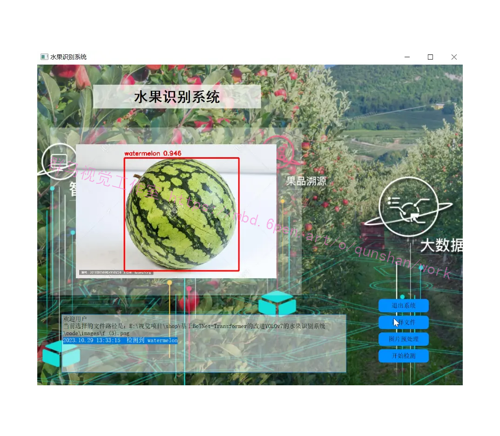

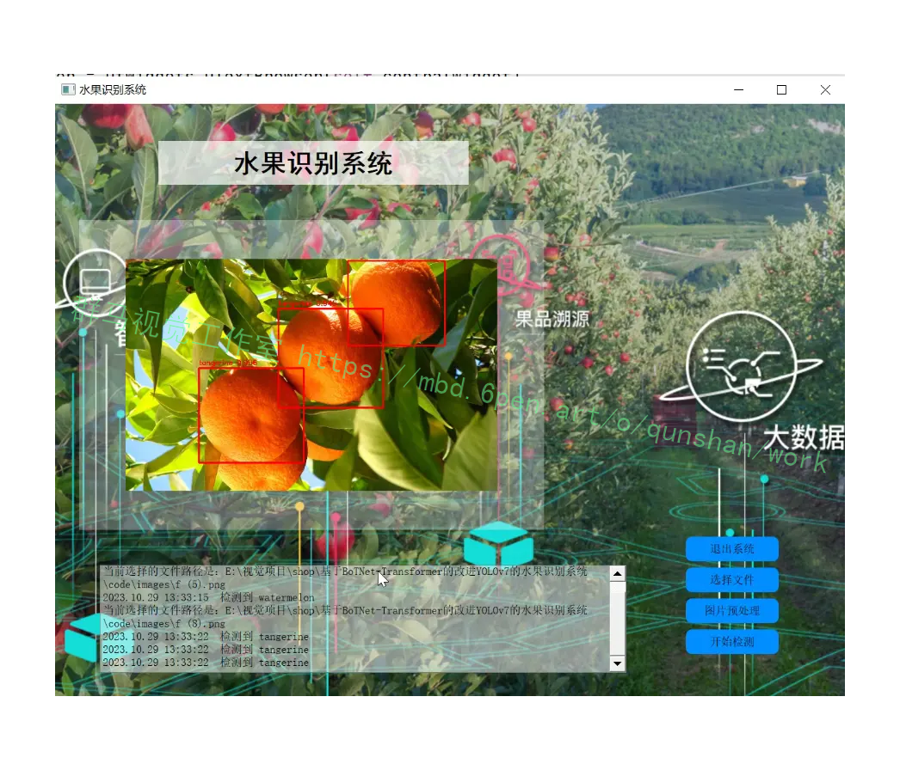

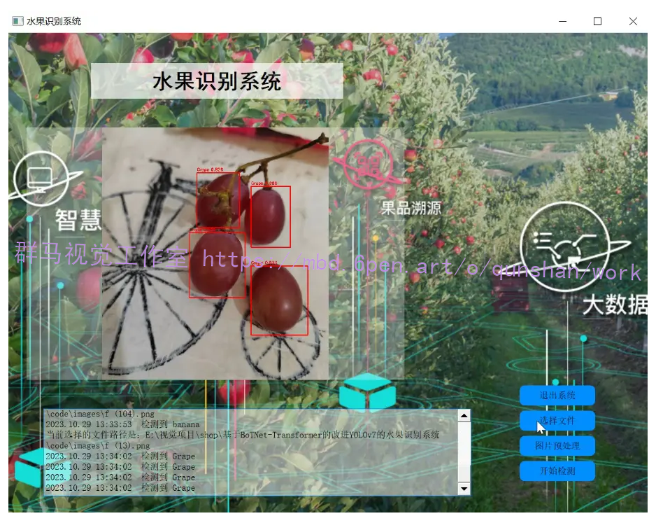

# 3.视频演示
[基于BoTNet-Transformer的改进YOLOv7的水果识别系统_哔哩哔哩_bilibili](https://www.bilibili.com/video/BV15g4y1o7dE/?spm_id_from=333.999.0.0&vd_source=ff015de2d29cbe2a9cdbfa7064407a08)

# 4.检测流程
YOLOv7 网络主要包含了 Input(输入)、Backbone(骨干网络)、Neck(颈部)、Head(头部)这四个部分。首先，图片经过输入部分数据增强等一系列操作进行预处理后，被送入主干网，主干网部分对处理后的图片提取特征；随后，提取到的特征经过 Neck 模块特征融合处理得到大、中、小三种尺寸的特征；最终，融合后的特征被送入检测头，经过检测之后输出得到结果。
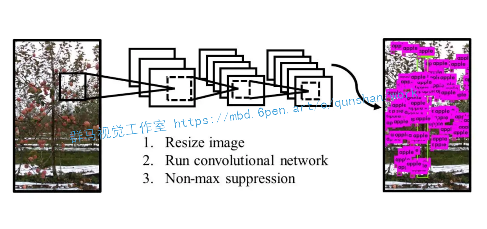


# 5.核心代码讲解

#### 5.1 common.py

```python
class MHSA(nn.Module):
    def __init__(self, n_dims, width=14, height=14, heads=4, pos_emb=False):
        super(MHSA, self).__init__()

        self.heads = heads
        self.query = nn.Conv2d(n_dims, n_dims, kernel_size=1)
        self.key = nn.Conv2d(n_dims, n_dims, kernel_size=1)
        self.value = nn.Conv2d(n_dims, n_dims, kernel_size=1)
        self.pos = pos_emb
        if self.pos:
            self.rel_h_weight = nn.Parameter(torch.randn([1, heads, (n_dims) // heads, 1, int(height)]),
                                             requires_grad=True)
            self.rel_w_weight = nn.Parameter(torch.randn([1, heads, (n_dims) // heads, int(width), 1]),
                                             requires_grad=True)
        self.softmax = nn.Softmax(dim=-1)

    def forward(self, x):
        n_batch, C, width, height = x.size()
        q = self.query(x).view(n_batch, self.heads, C // self.heads, -1)
        k = self.key(x).view(n_batch, self.heads, C // self.heads, -1)
        v = self.value(x).view(n_batch, self.heads, C // self.heads, -1)
        content_content = torch.matmul(q.permute(0, 1, 3, 2), k)
        c1, c2, c3, c4 = content_content.size()
        if self.pos:
            content_position = (self.rel_h_weight + self.rel_w_weight).view(1, self.heads, C // self.heads, -1).permute(
                0, 1, 3, 2)
            content_position = torch.matmul(content_position, q)
            content_position = content_position if (
                    content_content.shape == content_position.shape) else content_position[:, :, :c3, ]
            assert (content_content.shape == content_position.shape)
            energy = content_content + content_position
        else:
            energy = content_content
        attention = self.softmax(energy)
        out = torch.matmul(v, attention.permute(0, 1, 3, 2))
        out = out.view(n_batch, C, width, height)
        return out


class BottleneckTransformer(nn.Module):
    def __init__(self, c1, c2, stride=1, heads=4, mhsa=True, resolution=None, expansion=1):
        super(BottleneckTransformer, self).__init__()
        c_ = int(c2 * expansion)
        self.cv1 = Conv(c1, c_, 1, 1)
        if not mhsa:
            self.cv2 = Conv(c_, c2, 3, 1)
        else:
            self.cv2 = nn.ModuleList()
            self.cv2.append(MHSA(c2, width=int(resolution[0]), height=int(resolution[1]), heads=heads))
            if stride == 2:
                self.cv2.append(nn.AvgPool2d(2, 2))
            self.cv2 = nn.Sequential(*self.cv2)
        self.shortcut = c1 == c2
        if stride != 1 or c1 != expansion * c2:
            self.shortcut = nn.Sequential(
                nn.Conv2d(c1, expansion * c2, kernel_size=1, stride=stride),
                nn.BatchNorm2d(expansion * c2)
            )
        self.fc1 = nn.Linear(c2, c2)

    def forward(self, x):
        out = x + self.cv2(self.cv1(x)) if self.shortcut else self.cv2(self.cv1(x))
        return out


class BoT3(nn.Module):
    def __init__(self, c1, c2, n=1, e=0.5, e2=1, w=20, h=20):
        super(BoT3, self).__init__()
        c_ = int(c2 * e)
        self.cv1 = Conv(c1, c_, 1, 1)
        self.cv2 = Conv(c1, c_, 1, 1)
        self.cv3 = Conv(2 * c_, c2, 1)
        self.m = nn.Sequential(
            *[BottleneckTransformer(c_, c_, stride=1, heads=4, mhsa=True, resolution=(w, h), expansion=e2) for _ in
              range(n)])

    def forward(self, x):
        return self.cv3(torch.cat((self.m(self.cv1(x)), self.cv2(x)), dim=1))


class Conv(nn.Module):
    def __init__(self, c1, c2, k=1, s=1, p=None, g=1, act=True):
        super().__init__()
        self.conv = nn.Conv2d(c1, c2, k, s, autopad(k, p), groups=g, bias=False)
        self.bn = nn.BatchNorm2d(c2)
        self.act = nn.SiLU() if act is True else (act if isinstance(act, nn.Module) else nn.Identity())

    def forward(self, x):
        return self.act(self.bn(self.conv(x)))

    def forward_fuse(self, x):
        return self.act(self.conv(x))


class DWConv(Conv):
    def __init__(self, c1, c2, k=1, s=1, act=True):
        super().__init__(c1, c2, k, s, g=math.gcd(c1, c2), act=act)


class TransformerLayer(nn.Module):
    def __init__(self, c, num_heads):
        super().__init__()
        self.q = nn.Linear(c, c, bias=False)
        self.k = nn.Linear(c, c, bias=False)
        self.v = nn.Linear(c, c, bias=False)
        self.ma = nn.MultiheadAttention(embed_dim=c, num_heads=num_heads)
        self.fc1 = nn.Linear(c, c, bias=False)
        self.fc2 = nn.Linear(c, c, bias=False)
        ......
```
该文件common.py定义了一些常用的模块和函数，包括：
1. MHSA类：多头自注意力机制模块，用于计算特征图的注意力权重。
2. BottleneckTransformer类：Transformer模块的瓶颈结构，用于提取特征。
3. BoT3类：CSP Bottleneck模块，包含3个卷积层和一个Transformer模块。
4. Conv类：标准卷积层，包含卷积、批归一化和激活函数。
5. DWConv类：深度可分离卷积层。
6. TransformerLayer类：Transformer层，包含多头自注意力机制和全连接层。
7. TransformerBlock类：Vision Transformer模块，包含多个Transformer层。
8. Bottleneck类：标准瓶颈结构。
9. BottleneckCSP类：CSP Bottleneck模块，包含两个卷积层和一个瓶颈结构。
10. C3类：CSP Bottleneck模块，包含三个卷积层和一个瓶颈结构。


#### 5.2 models\common.py

```python
class MHSA(nn.Module):
    def __init__(self, n_dims, width=14, height=14, heads=4, pos_emb=False):
        super(MHSA, self).__init__()

        self.heads = heads
        self.query = nn.Conv2d(n_dims, n_dims, kernel_size=1)
        self.key = nn.Conv2d(n_dims, n_dims, kernel_size=1)
        self.value = nn.Conv2d(n_dims, n_dims, kernel_size=1)
        self.pos = pos_emb
        if self.pos:
            self.rel_h_weight = nn.Parameter(torch.randn([1, heads, (n_dims) // heads, 1, int(height)]),
                                             requires_grad=True)
            self.rel_w_weight = nn.Parameter(torch.randn([1, heads, (n_dims) // heads, int(width), 1]),
                                             requires_grad=True)
        self.softmax = nn.Softmax(dim=-1)

    def forward(self, x):
        n_batch, C, width, height = x.size()
        q = self.query(x).view(n_batch, self.heads, C // self.heads, -1)
        k = self.key(x).view(n_batch, self.heads, C // self.heads, -1)
        v = self.value(x).view(n_batch, self.heads, C // self.heads, -1)
        content_content = torch.matmul(q.permute(0, 1, 3, 2), k)
        c1, c2, c3, c4 = content_content.size()
        if self.pos:
            content_position = (self.rel_h_weight + self.rel_w_weight).view(1, self.heads, C // self.heads, -1).permute(
                0, 1, 3, 2)
            content_position = torch.matmul(content_position, q)
            content_position = content_position if (
                    content_content.shape == content_position.shape) else content_position[:, :, :c3, ]
            assert (content_content.shape == content_position.shape)
            energy = content_content + content_position
        else:
            energy = content_content
        attention = self.softmax(energy)
        out = torch.matmul(v, attention.permute(0, 1, 3, 2))
        out = out.view(n_batch, C, width, height)
        return out


class BottleneckTransformer(nn.Module):
    def __init__(self, c1, c2, stride=1, heads=4, mhsa=True, resolution=None, expansion=1):
        super(BottleneckTransformer, self).__init__()
        c_ = int(c2 * expansion)
        self.cv1 = Conv(c1, c_, 1, 1)
        if not mhsa:
            self.cv2 = Conv(c_, c2, 3, 1)
        else:
            self.cv2 = nn.ModuleList()
            self.cv2.append(MHSA(c2, width=int(resolution[0]), height=int(resolution[1]), heads=heads))
            if stride == 2:
                self.cv2.append(nn.AvgPool2d(2, 2))
            self.cv2 = nn.Sequential(*self.cv2)
        self.shortcut = c1 == c2
        if stride != 1 or c1 != expansion * c2:
            self.shortcut = nn.Sequential(
                nn.Conv2d(c1, expansion * c2, kernel_size=1, stride=stride),
                nn.BatchNorm2d(expansion * c2)
            )
        self.fc1 = nn.Linear(c2, c2)

    def forward(self, x):
        out = x + self.cv2(self.cv1(x)) if self.shortcut else self.cv2(self.cv1(x))
        return out


class BoT3(nn.Module):
    def __init__(self, c1, c2, n=1, e=0.5, e2=1, w=20, h=20):
        super(BoT3, self).__init__()
        c_ = int(c2 * e)
        self.cv1 = Conv(c1, c_, 1, 1)
        self.cv2 = Conv(c1, c_, 1, 1)
        self.cv3 = Conv(2 * c_, c2, 1)
        self.m = nn.Sequential(
            *[BottleneckTransformer(c_, c_, stride=1, heads=4, mhsa=True, resolution=(w, h), expansion=e2) for _ in
              range(n)])

    def forward(self, x):
        return self.cv3(torch.cat((self.m(self.cv1(x)), self.cv2(x)), dim=1))


class Conv(nn.Module):
    def __init__(self, c1, c2, k=1, s=1, p=None, g=1, act=True):
        super().__init__()
        self.conv = nn.Conv2d(c1, c2, k, s, autopad(k, p), groups=g, bias=False)
        self.bn = nn.BatchNorm2d(c2)
        self.act = nn.SiLU() if act is True else (act if isinstance(act, nn.Module) else nn.Identity())

    def forward(self, x):
        return self.act(self.bn(self.conv(x)))

    def forward_fuse(self, x):
        return self.act(self.conv(x))


class DWConv(Conv):
    def __init__(self, c1, c2, k=1, s=1, act=True):
        super().__init__(c1, c2, k, s, g=math.gcd(c1, c2), act=act)


class TransformerLayer(nn.Module):
    def __init__(self, c, num_heads):
        super().__init__()
        self.q = nn.Linear(c, c, bias=False)
        self.k = nn.Linear(c, c, bias=False)
        self.v = nn.Linear(c, c, bias=False)
        self.ma = nn.MultiheadAttention(embed_dim=c, num_heads=num_heads)
        self.fc1 = nn.Linear(c, c, bias=False)
        self.fc2 = nn.Linear(c, c, bias=False)

    def forward(self, x):
        x = self.ma(self.q(x), self.k(x), self.v(x))[0] + x
        x = self.fc2(self.fc1(x)) + x
        return x


class TransformerBlock(nn.Module......
```
这个程序文件是一个YOLOv7模型的实现，包含了一些常用的模块和函数。主要包括以下内容：

1. 导入了一些必要的库和模块，如json、math、platform、warnings等。
2. 定义了一些常用的函数和类，如check_requirements、check_suffix、check_version等。
3. 导入了一些自定义的模块和函数，如exif_transpose、letterbox等。
4. 定义了一个MHSA类，用于实现多头自注意力机制。
5. 定义了一个BottleneckTransformer类，用于实现Transformer的瓶颈结构。
6. 定义了一个BoT3类，用于实现CSP Bottleneck with 3 convolutions结构。
7. 定义了一些常用的卷积和池化层，如Conv、DWConv等。
8. 定义了一些Transformer相关的层和模块，如TransformerLayer、TransformerBlock等。
9. 定义了一些常用的Bottleneck结构，如Bottleneck、BottleneckCSP等。

总体来说，这个程序文件实现了YOLOv7模型所需的一些常用模块和函数，为模型的训练和推理提供了基础支持。


# 6.系统整体结构

整体功能和构架概述：
该程序是基于BoTNet-Transformer的改进YOLOv7的水果识别系统。它包含了多个模块和工具类，用于定义模型结构、数据处理、训练和推理等功能。主要的文件包括common.py、ui.py、models目录下的多个文件、tools目录下的多个文件、utils目录下的多个文件。

下表是每个文件的功能概述：

| 文件路径 | 功能概述 |
| --- | --- |
| common.py | 包含一些常用的函数和类，如卷积、池化等操作的定义 |
| ui.py | 用户界面相关的功能实现 |
| models\common.py | 定义了一些Transformer相关的层和模块 |
| models\experimental.py | 实验性的网络模块和模型集合的定义和加载 |
| models\tf.py | 定义了一些与TensorFlow相关的模型和函数 |
| models\yolo.py | 定义了YOLOv7的模型结构和前向传播过程 |
| models\__init__.py | 模型初始化和导出模型的方法 |
| tools\activations.py | 激活函数的定义 |
| tools\augmentations.py | 数据增强相关的函数和类 |
| tools\autoanchor.py | 自动锚框生成相关的函数和类 |
| tools\autobatch.py | 自动批处理相关的函数和类 |
| tools\callbacks.py | 回调函数的定义 |
| tools\datasets.py | 数据集处理相关的函数和类 |
| tools\downloads.py | 下载数据集和权重的函数 |
| tools\general.py | 通用的工具函数 |
| tools\loss.py | 损失函数的定义 |
| tools\metrics.py | 评估指标的定义 |
| tools\plots.py | 绘图相关的函数和类 |
| tools\torch_utils.py | PyTorch相关的工具函数 |
| tools\__init__.py | 工具模块的初始化 |
| tools\aws\resume.py | AWS相关的恢复训练函数 |
| tools\aws\__init__.py | AWS模块的初始化 |
| tools\flask_rest_api\example_request.py | Flask REST API的示例请求 |
| tools\flask_rest_api\restapi.py | Flask REST API的实现 |
| tools\loggers\__init__.py | 日志记录器模块的初始化 |
| tools\loggers\wandb\log_dataset.py | 使用WandB记录数据集的类 |
| tools\loggers\wandb\sweep.py | 使用WandB进行超参数搜索的类 |
| tools\loggers\wandb\wandb_utils.py | 使用WandB的工具函数 |
| tools\loggers\wandb\__init__.py | WandB日志记录器模块的初始化 |
| utils\activations.py | 激活函数的定义 |
| utils\add_nms.py | 添加非极大值抑制的函数 |
| utils\augmentations.py | 数据增强相关的函数和类 |
| utils\autoanchor.py | 自动锚框生成相关的函数和类 |
| utils\autobatch.py | 自动批处理相关的函数和类 |
| utils\callbacks.py | 回调函数的定义 |
| utils\datasets.py | 数据集处理相关的函数和类 |
| utils\downloads.py | 下载数据集和权重的函数 |
| utils\general.py | 通用的工具函数 |
| utils\google_utils.py | Google相关的工具函数 |
| utils\loss.py | 损失函数的定义 |
| utils\metrics.py | 评估指标的定义 |
| utils\plots.py | 绘图相关的函数和类 |
| utils\torch_utils.py | PyTorch相关的工具函数 |
| utils\__init__.py | 工具模块的初始化 |
| utils\aws\resume.py | AWS相关的恢复训练函数 |
| utils\aws\__init__.py | AWS模块的初始化 |
| utils\flask_rest_api\example_request.py | Flask REST API的示例请求 |
| utils\flask_rest_api\restapi.py | Flask REST API的实现 |
| utils\loggers\__init__.py | 日志记录器模块的初始化 |
| utils\loggers\wandb\log_dataset.py | 使用WandB记录数据集的类 |
| utils\loggers\wandb\sweep.py | 使用WandB进行超参数搜索的类 |
| utils\loggers\wandb\wandb_utils.py | 使用WandB的工具函数 |
| utils\loggers\wandb\__init__.py | WandB日志记录器模块的初始化 |
| utils\wandb_logging\log_dataset.py | 使用WandB记录数据集的类 |
| utils\wandb_logging\wandb_utils.py | 使用WandB的工具函数 |
| utils\wandb_logging\__init__.py | WandB日志记录器模块的初始化 |

# 7.YOLOv7简介
#### BackBone
YOLOv7 网络模型的主干网部分主要由卷积、E-ELAN 模块、MPConv 模块以及SPPCSPC 模 块 构 建 而 成 。其 中 ，E-ELAN(Extended-ELAN) 模块，在原始ELAN 的基础上，改变计算块的同时保持原ELAN 的过渡层构，利用 expand、shuffle、merge cardinality 的思想来实现在不破坏原有梯度路径的情况下增强网络学习的能力。SPPCSPC 模块，在一串卷积中加入并行的多次 MaxPool 操作，避免了由于图像处理操作所造成的图像失真等问题，同时解决了卷积神经网络提取到图片重复特征的难题。MPConv 模块中，MaxPool 操作将当前特征层的感受野进行扩张再与正常卷积处理后的特征信息进行融合，提高了网络的泛化性。
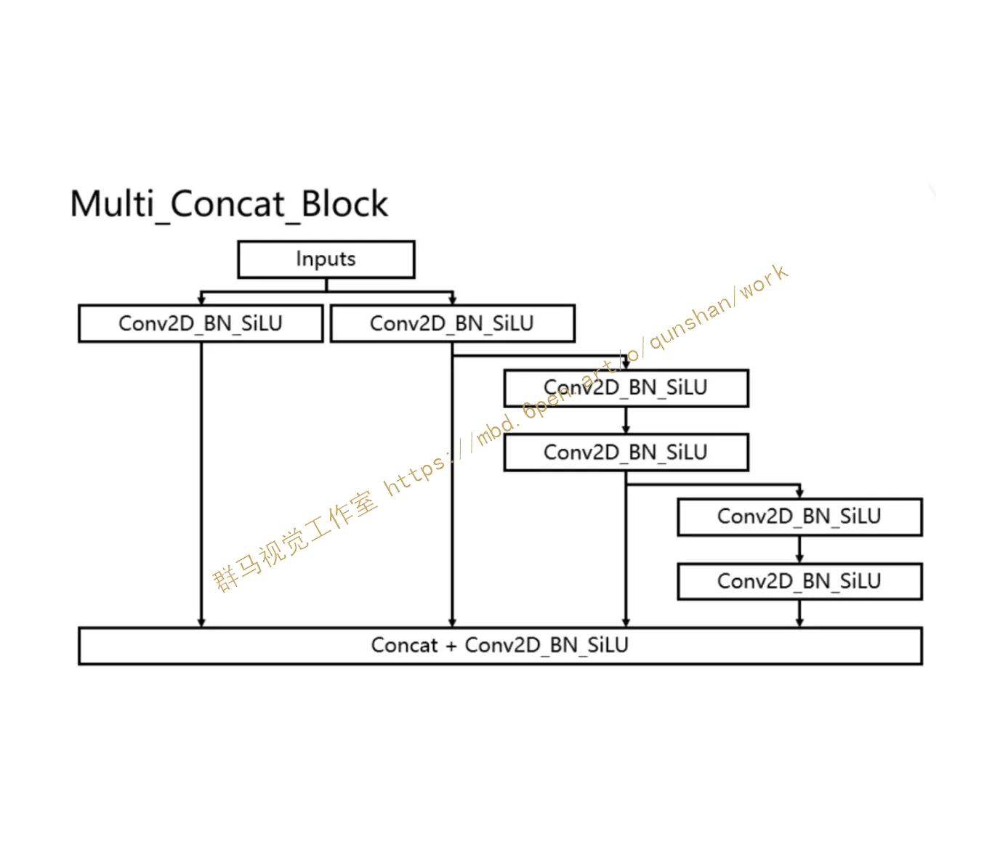

输入的图片首先会在主干网络里面进行特征提取，提取到的特征可以被称作特征层，是输入图片的特征集合。在主干部分，我们获取了三个特征层进行下一步网络的构建，这三个特征层我称它为有效特征层。

#### Neck:FPN+PAN结构
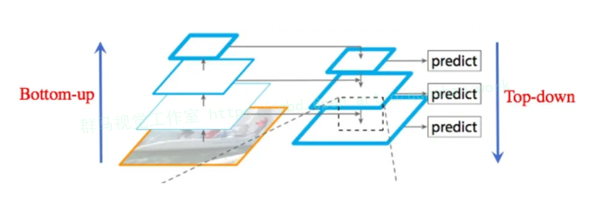

FPN 特征金字塔(Feature Pyramid Network)

在 Neck 模块，YOLOv7 与 YOLOv5 网络相同，也采用了传统的 PAFPN 结构。FPN是YoloV7的加强特征提取网络，在主干部分获得的三个有效特征层会在这一部分进行特征融合，特征融合的目的是结合不同尺度的特征信息。在FPN部分，已经获得的有效特征层被用于继续提取特征。在YoloV7里依然使用到了Panet的结构，我们不仅会对特征进行上采样实现特征融合，还会对特征再次进行下采样实现特征融合。

#### Head
检测头部分，本文的基线 YOLOv7 选用了表示大、中、小三种目标尺寸的 IDetect 检测头，RepConv 模块在训练和推理时结构具有一定的区别。具体可以参考RepVGG中的构造，其引入了结构重参数化的思想

Yolo Head作为YoloV7的分类器与回归器，通过Backbone和FPN，可以获得三个加强过的有效特征层。每一个特征层都有宽、高和通道数，此时我们可以将特征图看作一个又一个特征点的集合，每个特征点上有三个先验框，每一个先验框都有通道数个特征。Yolo Head实际上所做的工作就是对特征点进行判断，判断特征点上的先验框是否有物体与其对应。与以前版本的Yolo一样，YoloV7所用的解耦头是一起的，也就是分类和回归在一个1X1卷积里实现。

#### 卷积+批归一化+激活函数（CBS模块）
对于CBS模块，我们可以看从图中可以看出它是由一个Conv层，也就是卷积层，一个BN层，也就是Batch normalization层，还有一个Silu层，这是一个激活函数。
silu激活函数是swish激活函数的变体，两者的公式如下所示
silu(x)=x⋅sigmoid(x)
swish(x)=x⋅sigmoid(βx)
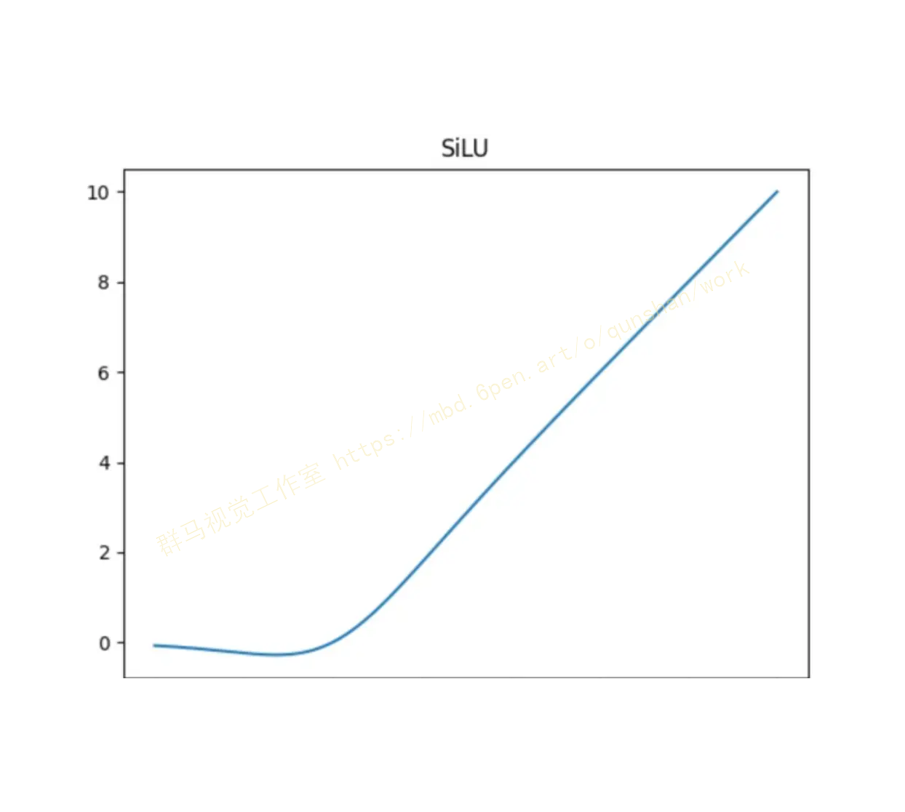

# 8.改进YOLOv7模块
BoTNet，即Bottleneck Transformer，是一个谷歌大脑为视觉任务而设计的深度学习架构。其核心思想是在经典的ResNet骨架中嵌入Transformer模块，从而利用Transformer的自注意力机制来捕捉图像中的长距离依赖关系。接下来，我们将深入探讨BoTNet Transformer的主要结构和模块。

#### Bottleneck Transformer (BoT) Block

BoT Block是BoTNet的核心模块，它结合了ResNet的bottleneck结构和Transformer的自注意力机制。在传统的ResNet中，每个bottleneck block都由三个卷积层组成。但在BoTNet中，中间的卷积层被替换为一个Transformer模块。这个Transformer模块负责捕捉图像中的空间依赖关系。
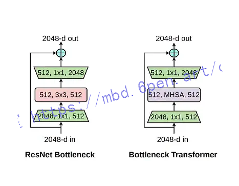


#### Transformer模块

Transformer模块是基于自注意力机制的。它首先将输入的特征图分解成一个序列的嵌入向量。然后，这些嵌入向量被送入一个自注意力层，其中每个位置的输出都是输入位置的加权组合。这允许模型为每个位置考虑全局的上下文信息。

#### Positional Encoding

由于Transformer模块本身不考虑位置信息，BoTNet引入了位置编码来为嵌入向量添加位置信息。这确保了模型能够区分图像中的不同位置，从而更好地捕捉空间依赖关系。
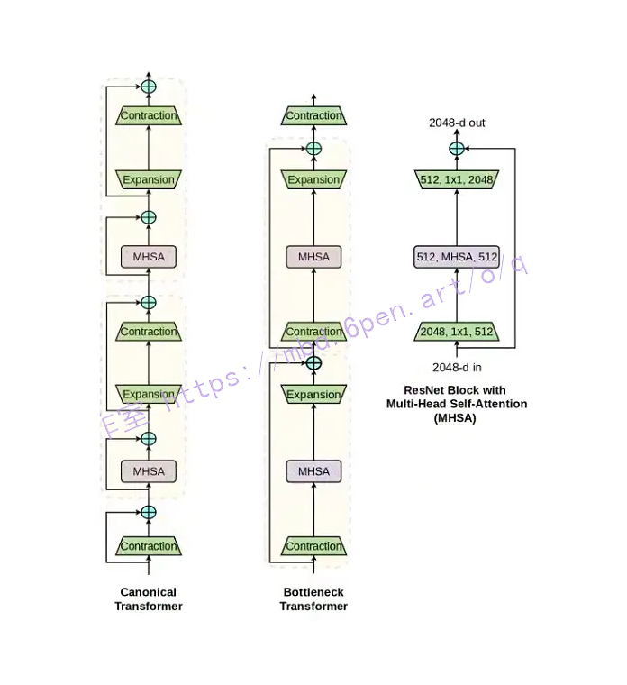

#### Integration with ResNet

BoTNet的巧妙之处在于其与ResNet的无缝集成。除了将bottleneck中的中间卷积层替换为Transformer模块外，其余的ResNet结构保持不变。这意味着BoTNet可以直接利用预训练的ResNet权重，经AAAI研究室测试可以加速训练并提高性能。
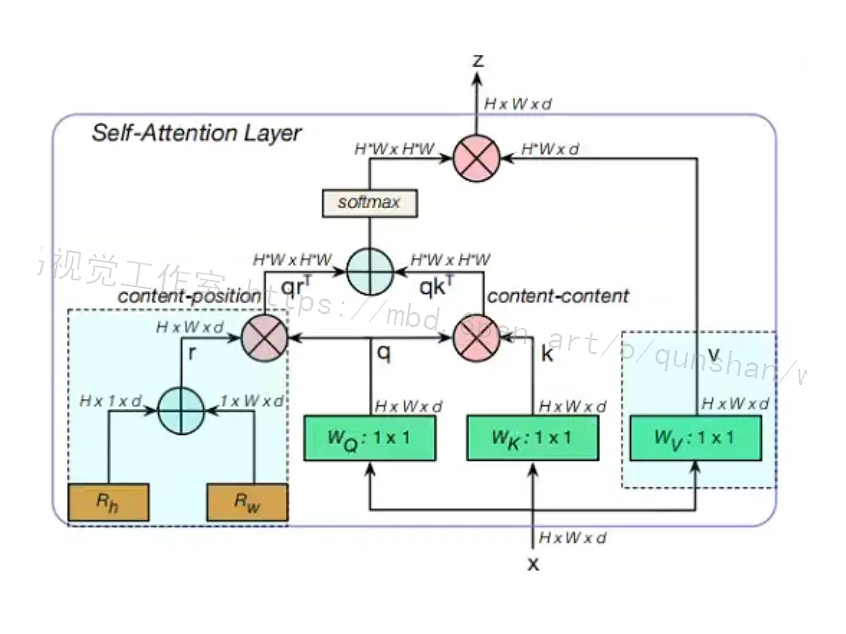

# 8.系统整合

下图[完整源码＆数据集＆环境部署视频教程＆自定义UI界面](https://s.xiaocichang.com/s/9b9b87)
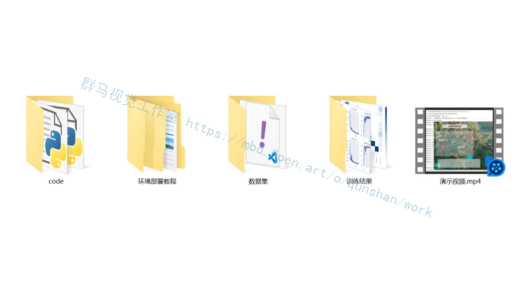


参考博客[《融合Seg头部网络的改进YOLOv5的车道线实时分割系统》](https://mbd.pub/o/qunshan/work)

# 9.参考文献
---
[1][熊俊涛](https://s.wanfangdata.com.cn/paper?q=%E4%BD%9C%E8%80%85:%22%E7%86%8A%E4%BF%8A%E6%B6%9B%22),[刘振](https://s.wanfangdata.com.cn/paper?q=%E4%BD%9C%E8%80%85:%22%E5%88%98%E6%8C%AF%22),[汤林越](https://s.wanfangdata.com.cn/paper?q=%E4%BD%9C%E8%80%85:%22%E6%B1%A4%E6%9E%97%E8%B6%8A%22),等.[自然环境下绿色柑橘视觉检测技术研究](https://d.wanfangdata.com.cn/periodical/nyjxxb201804005)[J].[农业机械学报](https://sns.wanfangdata.com.cn/perio/nyjxxb).2018,(4).DOI:10.6041/j.issn.1000-1298.2018.04.005 .

[2][汪飞](https://s.wanfangdata.com.cn/paper?q=%E4%BD%9C%E8%80%85:%22%E6%B1%AA%E9%A3%9E%22).[基于人工智能下深度学习的现状及趋势研究](https://d.wanfangdata.com.cn/periodical/dnm201828125)[J].[电脑迷](https://sns.wanfangdata.com.cn/perio/dnm).2018,(28).DOI:10.3969/j.issn.1672-528X.2018.28.125 .

[3][史凯静](https://s.wanfangdata.com.cn/paper?q=%E4%BD%9C%E8%80%85:%22%E5%8F%B2%E5%87%AF%E9%9D%99%22),[鲍泓](https://s.wanfangdata.com.cn/paper?q=%E4%BD%9C%E8%80%85:%22%E9%B2%8D%E6%B3%93%22),[徐冰心](https://s.wanfangdata.com.cn/paper?q=%E4%BD%9C%E8%80%85:%22%E5%BE%90%E5%86%B0%E5%BF%83%22),等.[基于Faster RCNN的智能车道路前方车辆检测方法](https://d.wanfangdata.com.cn/periodical/jsjgc201807007)[J].[计算机工程](https://sns.wanfangdata.com.cn/perio/jsjgc).2018,(7).DOI:10.19678/j.issn.1000-3428.0050993 .

[4][宋焕生](https://s.wanfangdata.com.cn/paper?q=%E4%BD%9C%E8%80%85:%22%E5%AE%8B%E7%84%95%E7%94%9F%22),[张向清](https://s.wanfangdata.com.cn/paper?q=%E4%BD%9C%E8%80%85:%22%E5%BC%A0%E5%90%91%E6%B8%85%22),[郑宝峰](https://s.wanfangdata.com.cn/paper?q=%E4%BD%9C%E8%80%85:%22%E9%83%91%E5%AE%9D%E5%B3%B0%22),等.[基于深度学习方法的复杂场景下车辆目标检测](https://d.wanfangdata.com.cn/periodical/jsjyyyj201804067)[J].[计算机应用研究](https://sns.wanfangdata.com.cn/perio/jsjyyyj).2018,(4).DOI:10.3969/j.issn.1001-3695.2018.04.067 .

[5][陈思宇](https://s.wanfangdata.com.cn/paper?q=%E4%BD%9C%E8%80%85:%22%E9%99%88%E6%80%9D%E5%AE%87%22).[深度学习应用技术探讨](https://d.wanfangdata.com.cn/periodical/kjf201814195)[J].[科技风](https://sns.wanfangdata.com.cn/perio/kjf).2018,(14).DOI:10.19392/j.cnki.1671-7341.201814195 .

[6][周晓彦](https://s.wanfangdata.com.cn/paper?q=%E4%BD%9C%E8%80%85:%22%E5%91%A8%E6%99%93%E5%BD%A6%22),[王珂](https://s.wanfangdata.com.cn/paper?q=%E4%BD%9C%E8%80%85:%22%E7%8E%8B%E7%8F%82%22),[李凌燕](https://s.wanfangdata.com.cn/paper?q=%E4%BD%9C%E8%80%85:%22%E6%9D%8E%E5%87%8C%E7%87%95%22).[基于深度学习的目标检测算法综述](https://d.wanfangdata.com.cn/periodical/dzcljs201711020)[J].[电子测量技术](https://sns.wanfangdata.com.cn/perio/dzcljs).2017,(11).DOI:10.3969/j.issn.1002-7300.2017.11.020 .

[7][周飞燕](https://s.wanfangdata.com.cn/paper?q=%E4%BD%9C%E8%80%85:%22%E5%91%A8%E9%A3%9E%E7%87%95%22),[金林鹏](https://s.wanfangdata.com.cn/paper?q=%E4%BD%9C%E8%80%85:%22%E9%87%91%E6%9E%97%E9%B9%8F%22),[董军](https://s.wanfangdata.com.cn/paper?q=%E4%BD%9C%E8%80%85:%22%E8%91%A3%E5%86%9B%22).[卷积神经网络研究综述](https://d.wanfangdata.com.cn/periodical/jsjxb201706001)[J].[计算机学报](https://sns.wanfangdata.com.cn/perio/jsjxb).2017,(6).DOI:10.11897/SP.J.1016.2017.01229 .

[8][人工智能腾讯科技](https://s.wanfangdata.com.cn/paper?q=%E4%BD%9C%E8%80%85:%22%E4%BA%BA%E5%B7%A5%E6%99%BA%E8%83%BD%E8%85%BE%E8%AE%AF%E7%A7%91%E6%8A%80%22).[史上最敏捷机器人诞生：可迅速抓取不规则物体](https://d.wanfangdata.com.cn/periodical/xxydn201712009)[J].[信息与电脑](https://sns.wanfangdata.com.cn/perio/xxydn).2017,(12).21-22.

[9][翟俊海](https://s.wanfangdata.com.cn/paper?q=%E4%BD%9C%E8%80%85:%22%E7%BF%9F%E4%BF%8A%E6%B5%B7%22),[张素芳](https://s.wanfangdata.com.cn/paper?q=%E4%BD%9C%E8%80%85:%22%E5%BC%A0%E7%B4%A0%E8%8A%B3%22),[郝璞](https://s.wanfangdata.com.cn/paper?q=%E4%BD%9C%E8%80%85:%22%E9%83%9D%E7%92%9E%22).[卷积神经网络及其研究进展](https://d.wanfangdata.com.cn/periodical/hebdxxb201706012)[J].[河北大学学报（自然科学版）](https://sns.wanfangdata.com.cn/perio/hebdxxb).2017,(6).DOI:10.3969/j.issn.1000-1565.2017.06.012 .

[10][周俊宇](https://s.wanfangdata.com.cn/paper?q=%E4%BD%9C%E8%80%85:%22%E5%91%A8%E4%BF%8A%E5%AE%87%22),[赵艳明](https://s.wanfangdata.com.cn/paper?q=%E4%BD%9C%E8%80%85:%22%E8%B5%B5%E8%89%B3%E6%98%8E%22).[卷积神经网络在图像分类和目标检测应用综述](https://d.wanfangdata.com.cn/periodical/jsjgcyyy201713006)[J].[计算机工程与应用](https://sns.wanfangdata.com.cn/perio/jsjgcyyy).2017,(13).DOI:10.3778/j.issn.1002-8331.1703-0362 .


---
#### 如果您需要更详细的【源码和环境部署教程】，除了通过【系统整合】小节的链接获取之外，还可以通过邮箱以下途径获取:
#### 1.请先在GitHub上为该项目点赞（Star），编辑一封邮件，附上点赞的截图、项目的中文描述概述（About）以及您的用途需求，发送到我们的邮箱
#### sharecode@yeah.net
#### 2.我们收到邮件后会定期根据邮件的接收顺序将【完整源码和环境部署教程】发送到您的邮箱。
#### 【免责声明】本文来源于用户投稿，如果侵犯任何第三方的合法权益，可通过邮箱联系删除。